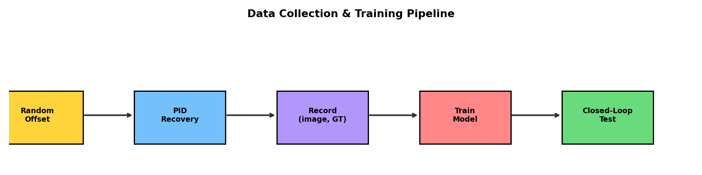
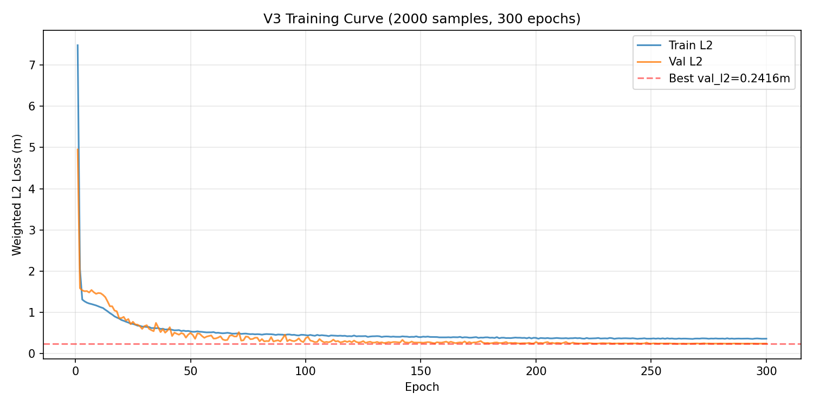
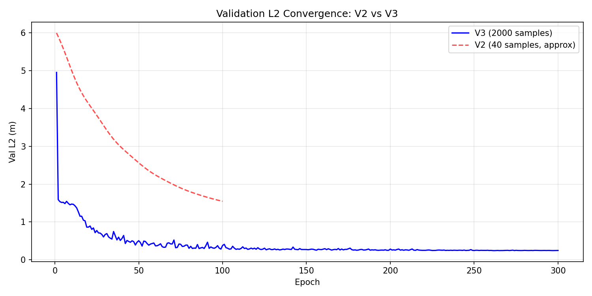
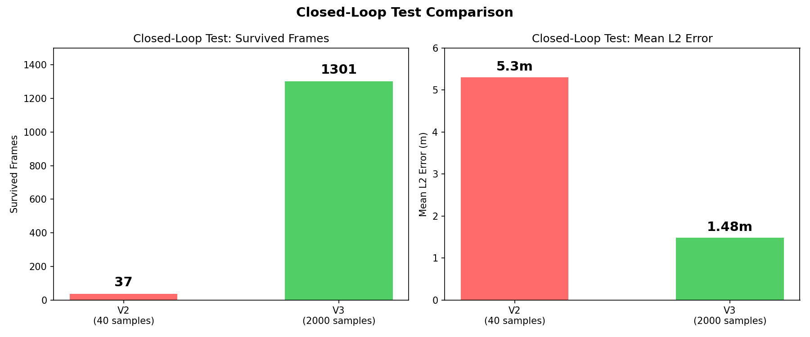

# 端到端自动驾驶仿真实验报告

日期: 2026-09-13 ~ 2026-09-17
环境: MetaDrive 仿真 | Ubuntu 20.04 | PyTorch 2.5.1+cu121

---

## 摘要

在 MetaDrive 仿真环境中，基于 DINOv3 视觉特征提取器 + MLP waypoint 预测头，进行了 4 个版本的迭代实验。从纯 PID 控制器 baseline 出发，逐步引入行为克隆训练，最终 2000 样本训练的模型在闭环测试中存活 1301 帧（V2 仅 37 帧），Mean L2 从 5.3m 降至 1.48m。

---

## 实验流程



1. PID 控制器在闭环赛道上录制专家数据
2. 对车辆施加随机偏移，PID 恢复过程中记录 (图片, GT waypoints)
3. 用收集的数据训练 DINOv3 + WaypointHead 模型
4. 闭环测试：模型推理 → PID 跟踪预测路径

---

## 模型架构

| 组件 | 说明 |
|------|------|
| 视觉编码器 | DINOv3 ViT-S/16 (frozen, 21.8M params) |
| 预测头 | MLP: 384→512→256→40, 可训练 0.175M params |
| 输入 | 单帧 RGB 640×360 |
| 输出 | 20 个 waypoints (世界坐标, 单位米) |
| 推理频率 | 10Hz |

---

## 各版本实验结果

### V1: PID Baseline

纯 PID + Pure Pursuit 路径跟踪，无神经网络。

- 赛道: 闭环赛道，总长约 10.8km (直道 + 弯道)
- 目标速度: 70 km/h
- 结果: 可无限循环行驶，作为专家数据源

### V2: DINOv3 首次尝试 (40 样本)

| 指标 | 数值 |
|------|------|
| 训练样本数 | 40 |
| 训练 epochs | 100 |
| 最终 val_l2 | 1.14 m |
| 闭环存活帧数 | **37 帧** |
| 闭环 Mean L2 | **5.3 m** |
| 终止原因 | 横向误差 > 15m |

**结论**: 40 个样本严重不足，模型泛化能力极差，几帧内就偏离赛道。

### V3: DINOv3 2000 样本

| 指标 | 数值 |
|------|------|
| 训练样本数 | 2000 |
| 训练 epochs | 300 |
| 最终 val_l2 | **0.24 m** (epoch 262) |
| 闭环存活帧数 | **1301 帧** |
| 闭环 Mean L2 | **1.48 m** |
| 终止原因 | 横向误差 > 15m |



**结论**: 数据量提升 50 倍，val_l2 从 1.14m 降至 0.24m，闭环存活帧数从 37 提升至 1301（35 倍提升）。

### V2 vs V3 对比





| 版本 | 样本数 | val_l2 | 存活帧数 | Mean L2 | 提升倍数 |
|------|--------|--------|----------|---------|----------|
| V2 | 40 | 1.14m | 37 | 5.3m | baseline |
| V3 | 2000 | 0.24m | 1301 | 1.48m | **35x** |

---

## 问题分析

### 分布偏移 (Distribution Shift)

行为克隆的固有缺陷：

- 训练时：专家（PID）完美驾驶，模型只看到"车在路中间"的画面
- 推理时：模型产生小误差 → 车辆偏离 → 看到陌生画面 → 更大误差 → 崩溃

V3 虽然存活 1301 帧，但最终仍因横向误差过大终止，说明模型在偏离场景下缺乏纠偏能力。

### 数据过于单一

当前数据收集方式的问题：
- PID 恢复太快（~80 步收敛），GT waypoints 几乎都是"正常行驶"
- 只有一种 PID 参数、一种速度
- 缺乏多样化的驾驶行为

### 人为扰动的局限

尝试了加大扰动（±5m, ±30°）+ 只取恢复段前 30 步做 GT，但：
- 量产自动驾驶不会刻意打散数据
- 向领导汇报时难以解释为何人为增加难度
- 数据多样性应来自场景本身，不是人为扰动

---

## 下一步方向

### 1. 多驾驶风格数据收集

在现有赛道上，通过不同驾驶参数产生数据多样性：
- 不同速度: 50 / 60 / 70 / 80 km/h
- 不同 PID 参数: 激进（快速修正）/ 保守（缓慢修正）/ 正常
- 每种组合都是合理驾驶方式，不是人为扰动

### 2. DAgger 闭环迭代

DAgger 属于模仿学习（非强化学习），是行为克隆的升级版：
1. 用专家数据训练初始模型
2. 让模型自己开，遇到处理不了的情况时 PID 专家接管
3. 累积数据重新训练，迭代改进

关键点：模型自己犯的错误成为训练数据，不需要人为扰动。

### 3. 多赛道场景（后续迭代）

用 MetaDrive 程序化生成多种赛道增加场景多样性。本次不做，赛道搭建已花大量时间。

---

## 文件结构

```
auto-drive-1/
├── versions/                    # 各版本代码归档
│   ├── v1_pid_baseline/         # V1: PID 控制器
│   ├── v2_dinov3_first/         # V2: 首次 DINOv3 尝试 (40 样本)
│   ├── v3_dinov3_2000samples/   # V3: 2000 样本训练
│   └── v4_disturbance_injection/# V4: 扰动注入实验
├── train/
│   ├── figures/                 # 实验图表
│   ├── checkpoints/             # 模型权重
│   └── data/                    # 训练数据
└── plan/                        # 计划文档
```
